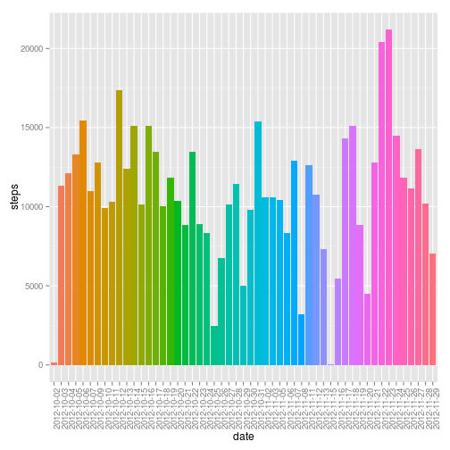
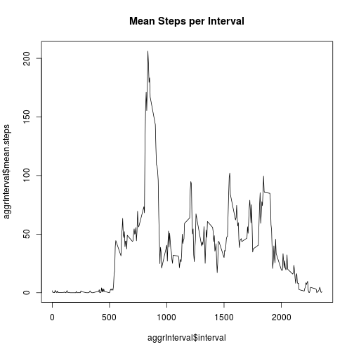
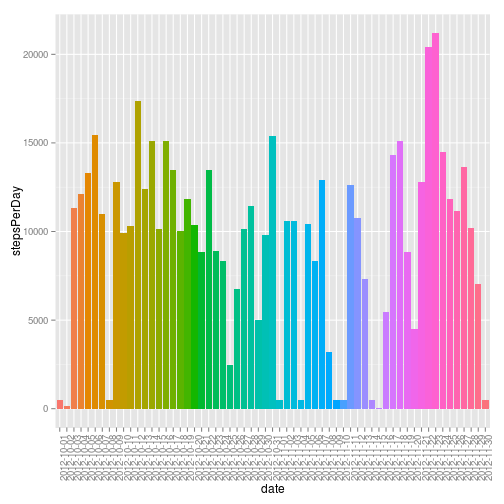
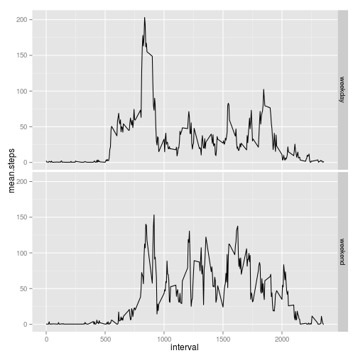

For this assignment we download and extract [Activity monitoring data](https://d396qusza40orc.cloudfront.net/repdata%2Fdata%2Factivity.zip) from personal activity monitoring devices. This device data was collected at 5 minute intervals through out the day. The data consists of two months of data from an anonymous individual collected during the months of October and November, 2012 and it includes the number of steps taken in 5 minute intervals each day.   

###Loading and processing the data  

```r
url<-"https://d396qusza40orc.cloudfront.net/repdata%2Fdata%2Factivity.zip"

if(!file.exists("repdata-data-activity.zip")){
  download.file(url,dest="repdata-data-activity.zip",method="curl")
  
  #extract the contents of the zip file
  unzip("repdata-data-activity.zip")
  print("repdata-data-activity.zip dataset extracted ")
}
```
Once the data has been downloaded and extracted we load the dataset into a frame.  


```r
dataset<-read.csv("activity.csv", header=T)
```
The loaded data looks like:  

```r
str(dataset)
```

```
## 'data.frame':	17568 obs. of  3 variables:
##  $ steps   : int  NA NA NA NA NA NA NA NA NA NA ...
##  $ date    : Factor w/ 61 levels "2012-10-01","2012-10-02",..: 1 1 1 1 1 1 1 1 1 1 ...
##  $ interval: int  0 5 10 15 20 25 30 35 40 45 ...
```
###What is mean total number of steps taken per day?
First we need to aggregate the dataset by date and to know the mean number of steps per date we just need to add the number of steps for each datet as follows:

```r
aggr<-aggregate(data=dataset, steps ~ date, sum, na.action=na.omit)

head(aggr)
```

```
##         date steps
## 1 2012-10-02   126
## 2 2012-10-03 11352
## 3 2012-10-04 12116
## 4 2012-10-05 13294
## 5 2012-10-06 15420
## 6 2012-10-07 11015
```

1. We make the histogram to show the total number of steps taken each day

```r
library(ggplot2)
library(grid)

ggplot(data=aggr, aes(x=date,y=steps, fill=date), )+geom_bar(stat="identity")+theme(axis.text.x = element_text(angle = 90, hjust = 1))+guides(fill=FALSE)
```

 

2. Calculate and report the **mean** and **median** total number of steps taken per day

```r
meanStepsPerDay<-mean(aggr$steps, na.rm=TRUE)
medianStepsPerDay<-median(aggr$steps, na.rm=TRUE)
```
Mean steps per day 10766.19  

Median steps per day 10765  

###What is the average daily activity pattern?
1. Make a time series plot (i.e. type = "l") of the 5-minute interval (x-axis) and the average number of steps taken, averaged across all days (y-axis)


```r
aggrInterval <- aggregate(data = dataset, steps ~ interval, mean, na.action=na.omit, simplify=TRUE)
names(aggrInterval) = c("interval", "mean.steps")
plot(aggrInterval$interval, aggrInterval$mean.steps, type="l", main="Mean Steps per Interval")
```

 


2. Which 5-minute interval, on average across all the days in the dataset, contains the maximum number of steps?


```r
maxMeanSteps <- max(aggrInterval$mean.steps)
```

The 5-minutes interval with the maximum average of steps is 206.17.

### Imputing missing values
Note that there are a number of days/intervals where there are missing values (coded as NA). The presence of missing days may introduce bias into some calculations or summaries of the data.

1. Calculate and report the total number of missing values in the dataset (i.e. the total number of rows with NAs)


The total number of rows with NA values are 2304 


2. Devise a strategy for filling in all of the missing values in the dataset. The strategy does not need to be sophisticated. For example, you could use the mean/median for that day, or the mean for that 5-minute interval, etc.

In order to impute the missing values, the following strategy is used: the missing value will be replaced by the mean of that 5-minute interval. The new dataset is in 'inputed' 

```r
inputed <- dataset;
nas <- is.na(inputed$steps)
inputed$steps[nas] <- unlist(subset(aggrInterval, inputed$interval == interval, select = mean.steps))[1]
```
3. Create a new dataset that is equal to the original dataset but with the missing data filled in.

This is a how the of the NA preprocessed data looks like 

```r
str(inputed)
```

```
## 'data.frame':	17568 obs. of  3 variables:
##  $ steps   : num  1.72 1.72 1.72 1.72 1.72 ...
##  $ date    : Factor w/ 61 levels "2012-10-01","2012-10-02",..: 1 1 1 1 1 1 1 1 1 1 ...
##  $ interval: int  0 5 10 15 20 25 30 35 40 45 ...
```

4. Make a histogram of the total number of steps taken each day and Calculate and report the mean and median total number of steps taken per day. 


```r
aggregatedinputed <- aggregate(data = inputed, steps ~ date, sum)
names(aggregatedinputed) = c("date", "stepsPerDay")

ggplot(data=aggregatedinputed, aes(x=date,y=stepsPerDay, fill=date), )+geom_bar(stat="identity")+theme(axis.text.x = element_text(angle = 90, hjust = 1))+guides(fill=FALSE)
```

 


The mean number of steps per day is 9419.08.  

The median number of steps per day is 10395.  

Do these values differ from the estimates from the first part of the assignment? What is the impact of imputing missing data on the estimates of the total daily number of steps?


```
## [1] "Yes"
```

### Are there differences in activity patterns between weekdays and weekends?
1. Create a new factor variable in the dataset with two levels – “weekday” and “weekend” indicating whether a given date is a weekday or weekend day.

I set my  machine locale to work in english, because my default is set to German:


```r
Sys.setlocale("LC_TIME", "en_US.UTF-8")
```

```
## [1] "en_US.UTF-8"
```

Now I compute  the equivalent day of the week for the dates  


```r
inputed$dateType <- "weekday"
weekends <- weekdays(as.Date(inputed$date)) %in% c("Saturday", "Sunday")
inputed$dateType[weekends] <- "weekend"
```

2.Make a panel plot containing a time series plot (i.e. type = "l") of the 5-minute interval (x-axis) and the average number of steps taken, averaged across all weekday days or weekend days (y-axis).


```r
aggrIntervalInputed <- aggregate(data = inputed, steps ~ interval + dateType, mean, simplify=TRUE)
aggrIntervalInputed$dateType<-factor(aggrIntervalInputed$dateType)
names(aggrIntervalInputed) = c("interval", "dateType", "mean.steps")
ggplot(aes(x=interval, y=mean.steps), data=aggrIntervalInputed)+ facet_grid(dateType ~ .) + geom_line()
```

 


